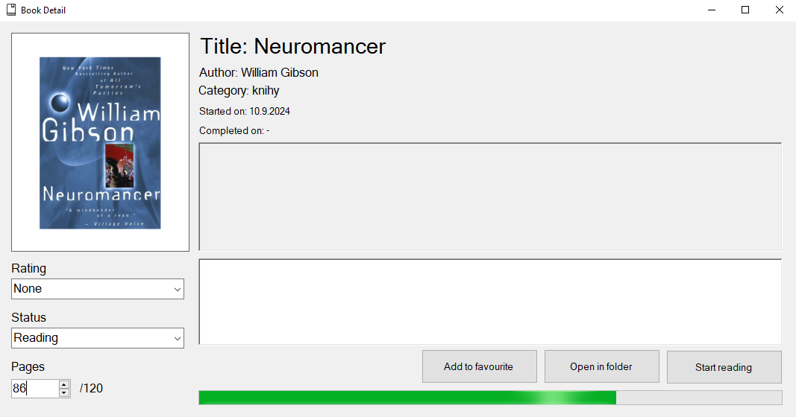

# BookManager

Aplikácia zameraná pre manažment kníh a dokumentov vo formáte *.pdf*.

## Popis

Hlavným účelom aplikácie je užívateľovi zjednodušiť prácu pri udržiavaní
si prehľadu vo veľkom množstve *pdf* súborov so zameraním na knihy.
Dáta sú uložené lokálne v XML súbore s možnosťou šifrovania. Aplikácia
je inšpirovaná web stránkou [MyAnimeList](https://myanimelist.net/).

## Inštalácia

### Požiadavky

* [GhostScript](https://www.ghostscript.com/releases/gsdnld.html) s verziou aspoň 10.03.0

### Inštalátor

1. Otvoriť *.sln* vo Visual Studiu
2. Buildnúť projekt "BookManagerInstaller"
3. Nainštalovať pomocou vygenerovaného inštalátora.
> [!WARNING]  
> Vybraná cieľová cesta inštalátora musí byť priečinok, ktorý nevyžaduje systémové oprávnenia pre vytváranie či mazanie súborov.

## Repozitár

    .
    ├── BookManager                  # Projekt BookManageru
    ├── BookManagerInstaller         # Generátor Inštalátoru pre BookManager
    ├── ExternalLibs                 # Externé knižnice (bez NuGet)
    ├── IDRemover                    # Projekt pre odstránenie ID z PDF súborov
    ├── SyncServer                   # Server pre synchronizáciu
    ├── TestingApp                   # Projekt pre testovanie nových vlastností programu
    ├── BookManager.sln
    ├── LICENSE
    └── README.md

## Bugy

* Privilégia aplikácie na vytváranie súborov.
* Vadná detekcia zašifrovaného XML súboru.
* GhostScript nerozpoznáva znaky mimo základnej ascii tabuľky.

## TODO

* Prerobiť ukladanie dát z XML do SQLite databázy.
* Odstrániť bug s privilégiami.
* Pridať synchronizáciu so serverom.
* Vytvoriť alebo nájsť alternatívu za GhostScript.

