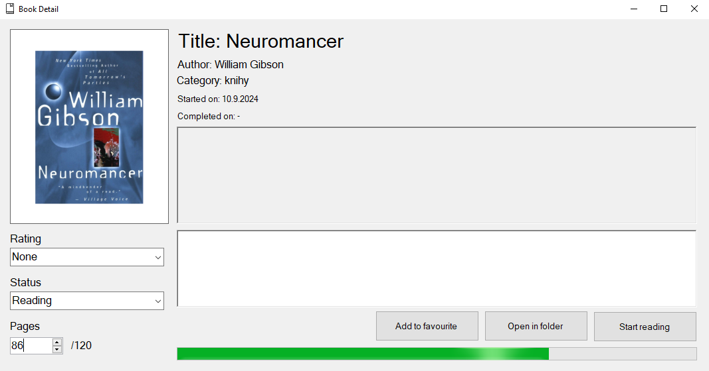

# BookManager

BookManager is a Windows desktop application for organizing and tracking a local PDF book library. It scans a selected folder structure, builds a browsable catalog, and stores reading progress, ratings, statuses, notes, and favorite books locally.

The project was built as a personal library manager inspired by list-tracking services such as [MyAnimeList](https://myanimelist.net/), adapted for offline PDF book collections.



## Features

- Automatically scans a local directory and its subfolders for PDF files.
- Organizes books into a tree view based on the folder structure.
- Tracks reading status: none, reading, completed, dropped, and on hold.
- Stores current page, total pages, rating, start date, completion date, and personal notes.
- Provides quick search by book title.
- Supports favorite books and library statistics such as completed books, currently reading books, dropped books, and total pages read.
- Opens books directly in the default PDF reader and can open the containing folder.
- Generates first-page PDF previews with Ghostscript.
- Stores application data locally in XML, with optional AES encryption.
- Includes early synchronization components for future client/server data syncing.

## Technology Stack

- **Language:** VB.NET
- **UI:** Windows Forms
- **Runtime:** .NET Framework 4.8
- **PDF processing:** PDFsharp, Ghostscript.NET, Ghostscript
- **Data storage:** Local XML file, optional AES encryption
- **Installer:** Visual Studio Installer Project
- **Experimental server component:** Python synchronization server prototype

## Repository Structure

```text
.
├── BookManager                  # Main Windows Forms application
├── BookManagerInstaller         # Visual Studio installer project
├── ExternalLibs                 # External libraries and installers not managed by NuGet
├── IDRemover                    # Utility for removing IDs from PDF files
├── SyncServer                   # Prototype synchronization server
├── TestingApp                   # Sandbox project for testing new features
├── BookManager.sln
├── LICENSE
└── README.md
```

## Requirements

- Windows
- Visual Studio with .NET Framework desktop development support
- .NET Framework 4.8 Developer Pack
- Ghostscript 10.03.0 or newer
- NuGet package restore enabled in Visual Studio

## Getting Started

1. Clone the repository.
2. Open `BookManager.sln` in Visual Studio.
3. Restore NuGet packages if Visual Studio does not do it automatically.
4. Build the `BookManager` project.
5. Make sure Ghostscript is installed and available on the target machine.
6. Run the application and choose a local folder containing PDF books.

## Building the Installer

1. Open `BookManager.sln` in Visual Studio.
2. Build the `BookManagerInstaller` project.
3. Run the generated installer.

> [!WARNING]
> Choose an installation directory where the application can create, update, and delete local data files without requiring administrator privileges.

## Current Limitations

- The installer path must allow normal user-level file operations.
- Encrypted XML file detection still needs more robust validation.
- Ghostscript may have issues with file paths containing characters outside the basic ASCII character set.
- Synchronization is represented by prototype components and is not yet a complete production feature.

## Planned Improvements

- Replace XML-based storage with SQLite.
- Improve application permission handling around local data files.
- Complete client/server synchronization.
- Replace or supplement Ghostscript with a more reliable PDF preview solution.
- Add broader validation and automated tests around file loading, encryption, and data persistence.

